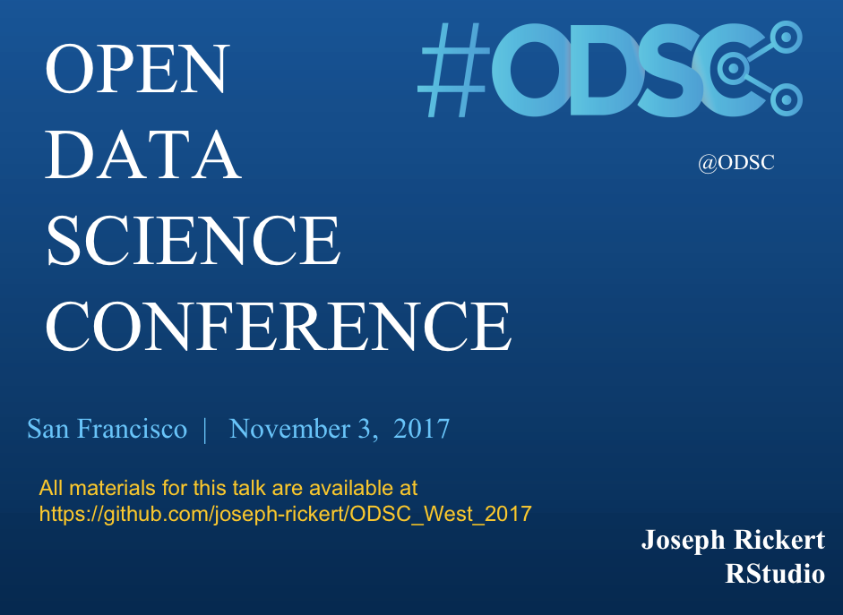
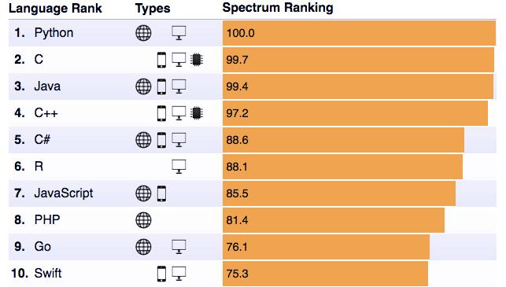
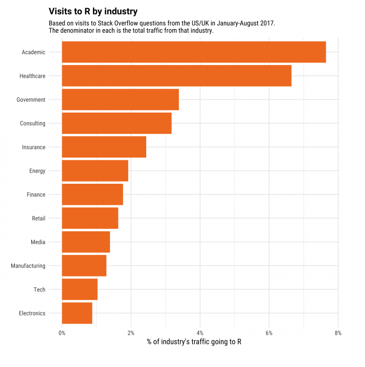
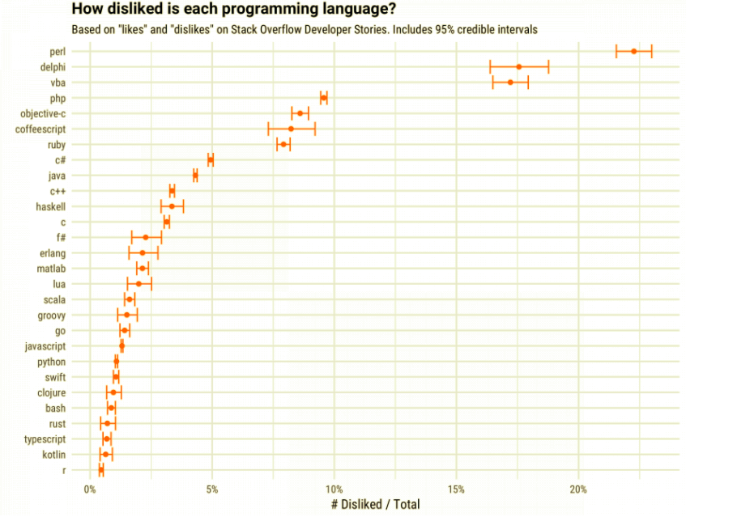
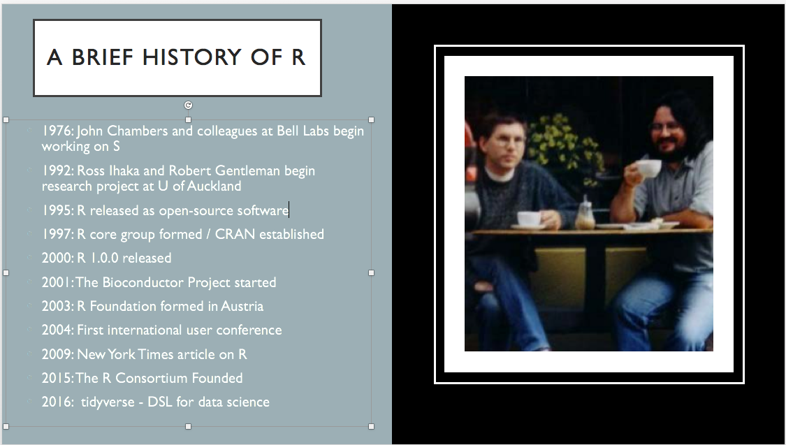
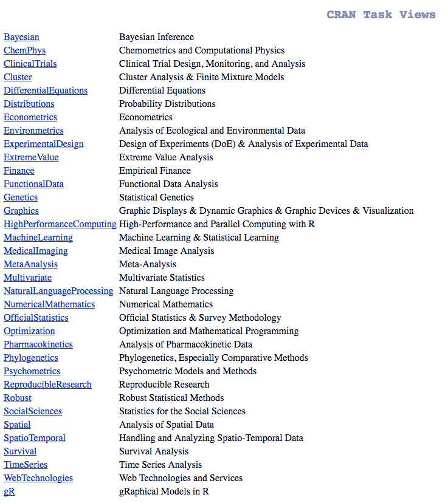
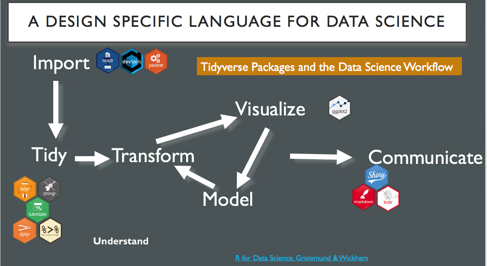
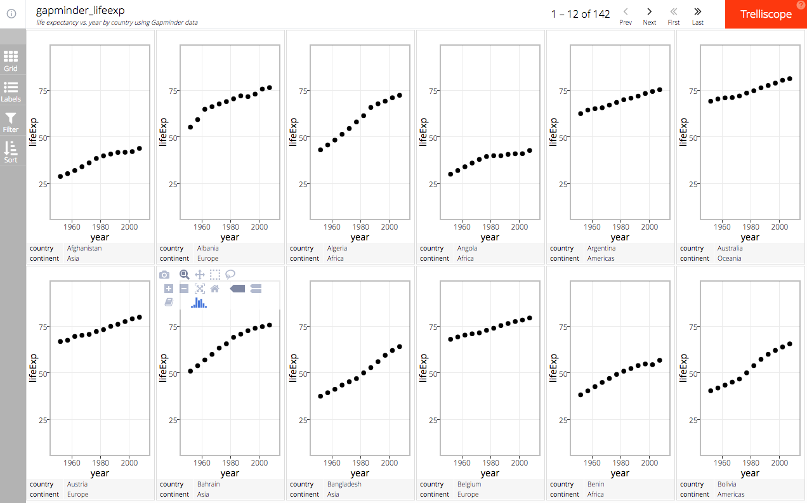
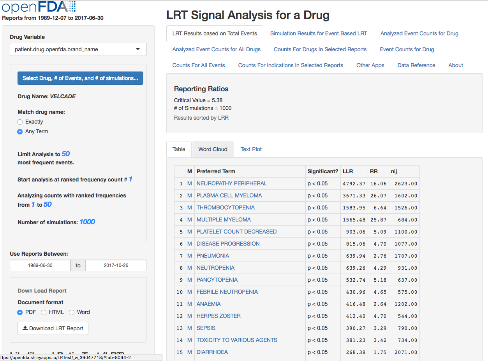
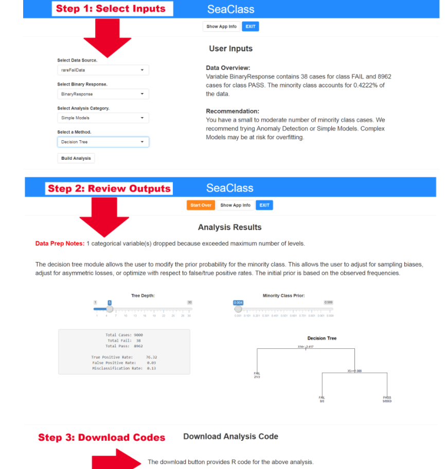

<br/>
<br/>

Not only is R the very best language for statistical inference, it is rapidly evolving to accommodate the needs of data scientists. In this session, we will discuss some of the tools available in R for practicing data science. We will begin with a review some of the fundamental strengths of the R language and then discuss how R is integrating into the world of production level data science.

For the fourth year in a row, R has made it into the [top 10 list](https://spectrum.ieee.org/computing/software/the-2017-top-programming-languages) of the IEEE Spectrum Magazine's survey of general purpose programming languages. That R should be there at all is astounding! Much of R's popularity can be attributed to the growth of data science. 
<br/>   


A recent [StackOverflow Post](https://stackoverflow.blog/2017/10/10/impressive-growth-r/) contained the following chart which shows the top twelve industries in the United States and the United Kingdom that generated R related questions. 



The chart clearly shows that after Academia, R traffic originating from the Healthcare dominates the traffic by generated by other industries.

Moreover, another chart published in the same post shows R traffic is generally growing faster in industries where it was already popular. Academia and Healthcare are pulling away from the pack.


<br/>      
In a follow-up Stackoverflow post R was identified as the least disliked language.



<br/>     

## Our Agenda 
After a short discussion of why the R Language itself is particularly well suited to data science, we will look at examples of R tools in seven categories:     
* Working in R   
* Manipulating Data   
* Accessing Data   
* Visualizing Data   
* Predictive Modeling   
* Machine Learning with Big Data   
* Sharing Results   

**Agenda Details**    
* **The R Language itself (10 min)**   
* A very brief history    
* The Structure of R    
* The R Package System   
* **Tools for Working in R (5 min)**   
* R Markdown     
* R Notebooks   
* **Tools for Manipulating Data (20 min)**   
* The Tidyverse   
* **Tools for Accessing Data (5 min)**  
* Accessing Databases    
* **Tools for Visualizing Data (5 min)**    
* htmlwidgets  
* Trelliscope    
* **Predictive Modeling Tools (10 min)**      
* The caret package   
* **Tools for Big Data Platforms (30 min)**    
* Spark and Sparklyr   
* Keras and Tensor Flow   
* **Tools for Sharing Results (5 min)**  
* Shiny   
<br/>    

## *________________________________________________________________________________________* 

## The R Language Itself
### A Very Brief History of R

To appreciate this R's growth, consider that R evolved from a relatively modest effort to develop an interface to Fortran statistical routines to a full featured language that provides access to the world's richest repository of statistical and machine learning algorithms. The following dates outline a short history of how this happened.
           

<br/>         
          
R is a direct descendant of the S Language developed at Bell Labs by John Chambers, Rick Becker and other, but it was also heavily influenced by Lisp and Scheme. Robert Gentleman and Ross Ihaka introduced Lisp like semantics to an ideas such as lexical scoping.

## *________________________________________________________________________________________* 

### The Structure of the R Language
####R is all about "Flow"

The R language was designed to enhance the experience of data exploration and statistical inference. The original intent of the S designers to make a convenient interface for their high powered Fortran rourines evolved into a project to make R a full-featured language for statistical inference and modeling. People productivity is at the core of the R experience. As John Chambers puts it in his book [Extending R](https://www.amazon.com/Extending-R-John-M-Chambers/dp/1138469270/ref=sr_1_1?ie=UTF8&qid=1506717425&sr=8-1&keywords=extending+r), **“One of the attractions of R has always been the ability to compute an interesting result quickly."** 
Ease of use and the ability to stay in the "flow" of an analysis is more important than computational efficiency.

**R is a functional, object-based language.** The three basic principles underlying R are:    
*  Everything that exists in R is an object    
*  Everything that happens in R is a function call    
*  Interfaces to other software are part of R    

Chambers elaborates on this last point as follows: **"A key motivation for the original S remains important now: to give easy access to the best computations for understanding data."** We see several examples of the efforts R developers put into connecting to the best things out there later in this presentation.

#### Objects and Functions
The interplay of objects and functions in R is apparent in the way in which data and statistical models are packaged. For example consider a simple linear model:

```{r}
x <- rnorm(100)
y <- rnorm(100)

reg <- lm(y ~ x)
summary(reg)
```

As the summary above indicates, R only returns model outputs when you ask for them and methods for generating summaries tend to be parsimonious. The model object `reg` packages quite a bit of information about the model.

```{r}
str(reg,give.attr=FALSE)

```


**Functions in R can call other functions.** This feature is well adapted to writing functions to estimate maximum likelihood and other statistical algorithms.

```{r}
# Two different rounding options
round(pi,4); signif(pi,4)     
# This is the way to have one function call another function
jmean <- function(x,FUN,...){
               m <- FUN(sum(x)/length(x),...)
               return(m)}

x <- rnorm(100)
jmean(x,round,4); jmean(x, signif,4)

```

#### Missing Values
A significant advantage that R has over other scripting languages is that it has an innate mechanism for dealing with missing values: **NA**.
```{r}
z <- c(1:3, NA)
z
is.na(z)

```

It is easy to identify and work with missing values in R.    

```{r}
a <- 1:5
b <- rnorm(5)
c <- LETTERS[1:5]
dF <- data.frame(a,b,c)
dF$b[3] <- NA; dF$c[4] <- NA
dF
na.omit(dF)
```

R also has several packages devoted to missing value imputation including:      [Amelia](https://cran.r-project.org/package=Amelia), [BaBooN](https://cran.r-project.org/package=BaBooN),    [cat](https://CRAN.R-project.org/package=cat), [ForImp](https://cran.r-project.org/package=ForImp),      [Hmisc](https://CRAN.R-project.org/package=Hmisc),      [impute](http://www.bioconductor.org/packages/release/bioc/html/impute.html),      [imputeMDR](https://cran.r-project.org/package=imputeMDR), [kmi](https://cran.r-project.org/package=kmi),    [mi](https://cran.r-project.org/package=mi), [mice](https://cran.r-project.org/package=mice),       [MImix](https://cran.r-project.org/package=MImix),  [missForest](https://cran.r-project.org/package=missForest),  [MissingDataGui](https://cran.r-project.org/package=MissingDataGUI),    [missMDA](https://CRAN.R-project.org/package=missMDA),     [mitools](https://cran.r-project.org/package=mitools), [mix](https://CRAN.R-project.org/package=mix),     [mtsdi](https://cran.r-project.org/package=mtsdi), [norm](https://CRAN.R-project.org/package=norm),     [pan](https://cran.r-project.org/package=pan),      [robCompositions](https://cran.r-project.org/package=robCompositions),     [rrcovNA](https://cran.r-project.org/package=rrcovNA),      [sbgcop](https://cran.r-project.org/package=sbgcop), [VIM](https://cran.r-project.org/package=VIM),      [yaImpute](https://cran.r-project.org/package=yaImpute), [Zelig](https://cran.r-project.org/package=Zelig)   

#### The Data Frame
A data frame is a list in which each row may represent an observation and each column a variable, is a natural data structure for statistical analysis. This consistent, ubiquitous data structure provides R with a big technical advantage. This is no accident. Both Robert Gentleman and Ross Ihaka believed in [Niklaus Wirth’s](https://en.wikipedia.org/wiki/Niklaus_Wirth) dictum: [`algorithms + data structures = programs`](https://en.wikipedia.org/wiki/Algorithms_%2B_Data_Structures_%3D_Programs).

## *________________________________________________________________________________________* 

### The R Package System
There are over 11,700 packages on CRAN, R's central repository. The algorithms in these packages comprise a transparent, documented statistical resource of great value. Searching the through CRAN is a challenge, but the [CRAN Task Views](https://cran.r-project.org/web/views/) lists of R packages, curated by experts and organized by application area mitigate the problem.



## *________________________________________________________________________________________* 

## Tools for Working in R

A good place to start is with an IDE and [R Markdown](http://rmarkdown.rstudio.com/)
Let's take a few minutes to examine this notebook and the R Markdown code.

## *________________________________________________________________________________________* 

## Tools for Manipulating Data
### The Tidyverse
Another great advantage of R is its ability to facilitate the construction of Domain Specific Languages. As Shiny's creator Joe Cheng puts it [(Interiew with Joe Cheng)](https://rviews.rstudio.com/2017/01/04/interview-with-joe-cheng/):

> If you look beyond the syntax, R really is conceptually very much like Lisp in a lot of ways. One of those ways is that it makes it very, very easy to compute on the programming language itself. ...

> I think day-to-day, R programmers probably don’t think about these things, but the elegant, terse syntax of dplyr and the pipe operator are possible because of how malleable a language R is and how great it is for writing DSLs in it.

> Personally, one of my pet peeves during these language wars is when people say that one of the dierences between say Python or Julia and R is that R is a DSL for stats, whereas these other things are general purpose languages. R is not a DSL. It’s a language for writing DSLs, which is something that’s altogether more powerful. I actually think that Julia has many of these same characteristics, but Python, even though it obviously has its own strengths, certainly doesn’t share that same level of fexibility.

One way to think of the [Tidyverse](https://www.tidyverse.org/) is that it is a DSL for doing data science. The packages that comprise the tidyverse offer a consistent, integrated set of functions for implementing the canonical data science workflow.


<br/>
<br/>
The name "tidyverse" comes from the concept of "tidy" data which Hadley Wickham, the tidyvrese's principal architect and implementer, describes as follows: 

> [Tidy data](http://vita.had.co.nz/papers/tidy-data.pdf) is a standard way of mapping the meaning of a dataset to its structure. A dataset is messy or tidy depending on how rows, columns and tables are matched up with observations, variables and types. In tidy data: (1) Each variable forms a column, (2) Each observation forms a row and (3) Each type of observational unit forms a table.

#### Manipulating and Transforming Data
The `dplyr` package which provides a consistent set of verbs for manipulating data provides the backbone structure for the import, tydy and transform sequence of the data science workflow. The basic `dplyr` verbs are:
* `filter()` to select cases based on their values    
* `arrange()` to reorder the cases   
* `select()` and `rename()` to select variables based on their names   
* `mutate()` and `transmute()` to add new variables that are functions of existing variables    
* `summarise()`  to condense multiple values to a single value    
* `sample_n()` and `sample_frac()`  to take random samples

Here, we will look at a few examples of working with these verbs using nycflights13::flights, a dataset containing all 336776 flights that departed from New York City in 2013. The data comes from the [US Bureau of Transportation Statistics](https://www.transtats.bts.gov/DatabaseInfo.asp?DB_ID=120&Link=0), and is documented in ?nycflights13

```{r, message=FALSE}
#install.packages("tidyverse","nycflights13")
library(nycflights13)
library(tidyverse)
data(flights)
flights
```


In this first example, we use `dplyr::filter()` to fetch flights that arrived early in January.

```{r}
# filter by departure delay and print the first few records
flights %>% filter(month == 1, dep_delay < 0)
```

`arrange()` reorders rows. It takes a data frame, and a set of column names (or more complicated expressions) to order by. If you provide more than one column name, each additional column will be used to break ties in the values of preceding columns:

```{r}
arrange(flights, sched_dep_time, dep_delay)

```

`select()` allows you to select columns by name. Here we select the columns `origin`, `dest` and `air_time`, and then sort by `air_time` from largest to smallest.

```{r}
select(flights, origin, dest, air_time) %>% arrange(desc(air_time))
```

`mutate()` allows you to add a new column to a data frame. Here we add in a column for airspeed.

```{r}
mutate(flights,
  gain = arr_delay - dep_delay,
  speed = distance / air_time * 60
)
```

`summarise()` will compute a statistic and collapse a data frame into a single row.

```{r}
dplyr::summarise(flights,
  delay = mean(dep_delay, na.rm = TRUE)
)
```

The `group_by()` functions allows you use the verbs discussed above on groups of observations in a dataset. Here we compute mean distance and arrival delay for each individual plane and plot the results.

```{r,warning=FALSE}
by_tailnum <- group_by(flights, tailnum)
delay <- dplyr::summarise(by_tailnum,
  count = n(),
  dist = mean(distance, na.rm = TRUE),
  delay = mean(arr_delay, na.rm = TRUE))
delay <- filter(delay, count > 20, dist < 2000)

# plot delays
library(ggplot2)
ggplot(delay, aes(dist, delay)) +
  geom_point(aes(size = count), alpha = 1/2) +
  geom_smooth()  +
  scale_size_area(max_size = 4)
```


For a more complete presentation using this data see the [dplyr vignette](https://cran.r-project.org/web/packages/dplyr/vignettes/dplyr.html).

## *________________________________________________________________________________________* 


## Tools for Accessing Data
### Accessing Databases
With the aid of the `DBI` package, `dply` is able to import data from several different open source data bases including *MySQL* and *MariaDB* with the [`RMariaDB`](https://github.com/rstats-db/RMariaDB) package, *Postgres* and *Redshift* with [`RPostgressSQL`](https://cran.r-project.org/web/packages/RPostgreSQL/), and *SQLite* with [`RSQLite`](https://cran.r-project.org/web/packages/RSQLite/index.html). 

The following simple example illustrates working with SQLite. Again, we use the nycflights13 data set to create a SQLite table with 1,000 rows and 19 columns.
```{r}
library(tidyverse)
library(DBI)
library(RSQLite)
library(dbplyr)
library(nycflights13)

con <- DBI::dbConnect(RSQLite::SQLite(), path = ":memory:")

copy_to(con, nycflights13::flights, "flights",
  temporary = FALSE, 
  indexes = list(
    c("year", "month", "day"), 
    "carrier", 
    "tailnum",
    "dest"
  )
)

flights_db <- tbl(con, "flights")
flights_db 
```

Now that we have established a connection to the database table, we can use the normal dplyr verbs to query the data.

```{r}
# List departure delay and arrival delay for year month and day.
flights_db %>% select(year:day, dep_delay, arr_delay)

# Find records with departure delay greater than 240 minutes.
flights_db %>% filter(dep_delay > 240)

# Summarize mean departure delay by destination airport
flights_db %>% 
  group_by(dest) %>%
  dplyr::summarise(delay = mean(dep_delay))

# disconnect from database
dbDisconnect(con)
```

`dplyr` can also be use with data stored in commercial databases. The [`bigquery`](https://CRAN.R-project.org/package=bigrquery) enables working with data in Google's [BigQuery](https://cloud.google.com/bigquery/) platform, and the [`odbc`](package) permits many commercial databases to be used as a `dplyr` backend through the open database connectivity protocol,

For additional information on basic `dbplyr` functionality see the [vignette](https://cran.r-project.org/web/packages/dbplyr/vignettes/dbplyr.html). For an advanced treatment using `dplyr` with commercial grade databases see the three blog posts from Edgar Ruiz:    
* [Databases using R](https://rviews.rstudio.com/2017/05/17/databases-using-r/)   
* [Visualizations with R and Databases](https://rviews.rstudio.com/2017/08/16/visualizations-with-r-and-databases/) 
* [Database Queries with R](https://rviews.rstudio.com/2017/10/18/database-queries-with-r/)
* [Enterprise-ready dashboards with Shiny and databases](https://rviews.rstudio.com/2017/09/20/dashboards-with-r-and-databases/).

**Be sure to catch Edgar's talk "Databases Using R" 11:30 AM tomorrow in room TR2**

## *________________________________________________________________________________________* 

## Tools for Visualizing Data
### Javascript Visualizations with htmlwidgets

There are three major plotting systems in R: (1) base graphics, (2) lattice graphics and (3) ggplot2, an example of which we have seen above. Additionally, there is a significant amount of development work going on to allow R users to produce JavaScript visualizations directly from R. In this section we will see an example of working with R's [htmlwidgets](http://www.htmlwidgets.org/) library.

For this example we will work with the htmlwidget `dygraphs` which is useful for producing interactive time series visualizations and use it to visualize the monthly flow from the Nile River from 1871 through 1984.

```{r}  
library(pracma)             # for Nile river data
data(nile)
head(nile)
```

This data set is not tidy. For each year, the information about monthly flow is spread over several columns. To tidy things up, we need to reshape the data frame into "long form" where the columns comprise the variables Year, Month and Flow. In the code below, the `tidy` function `gather()` accomplishes this. `arrange()` sorts the data by Year and Month, and mutate adds a new date variable to the data frame.

```{r}
nile_long <- nile %>% 
                  gather(Jan:Dec, key = "Month", value = "Flow") %>% 
                  arrange(Year,match(Month,month.abb)) %>% 
                  dplyr::mutate(
                  Date = as.Date(paste(Month,"-","15","-",as.character(Year),sep=""), format="%b-%d-%Y"))
  
head(nile_long)
```

Next, we produce some exploratory plots with ggplot2

```{r}
# Plot the time series
p <- ggplot(nile_long[100:300,],aes(x=Date,y=Flow))
p + geom_line() + geom_point(shape=1,col="red") + 
  ylab("Flow in cubic meters / second") + 
  ggtitle("Monthly Flow of Nile River at Dongola Station")


# Boxplots of monthly flows
b <- ggplot(nile_long,aes(factor(Month),Flow))
b + geom_boxplot() +
  xlab("Month") +
  ylab("Flow in cubic meters / second") + 
  ggtitle("Variation of Flow at Dongola Station by Month")
```   

We finish up by creating an interactive, JavaScript D3 interactive plot. To get the data ready for the `dygraph()` function we must make it an `xts` time series object.

```{r}
# Create an interactive graph with a Javascript library
library(xts)
library(dygraphs)
# Make into a time series object
nile_ts <- xts(nile_long$Flow,
               order.by=nile_long$Date,
               frequency=12,start=c(1871,1))

# Plot wit htmlwidget dygraph
dygraph(nile_ts,ylab="cubic m / s", 
        main="Nile Monthly Flow Data") %>%
  dySeries("V1",label="Flow") %>%
  dyRangeSelector(dateWindow = c("1871-01-01","1984-12-01"))
```   

To see some spectacular visualizations have a look at the [htmlwidgets for R gallery](http://gallery.htmlwidgets.org/).

## *________________________________________________________________________________________*   

### Visualizing Large Data Sets with Trelliscope
[Trelliscope](https://hafen.github.io/trelliscopejs/#trelliscope) is a system for producing detailed visualizations of very large, complex datasets. Thousands of plots are produced and the system computes metrics on each plot that describe interesting quantitative and qualitative features. Users can then sample, filter, or sort the plots based on the metrics. In Trelliscope terminology, these metrics are called "cognostics", a term coined by John Tukey which stands for “computer guiding diagnostics”

[Example using gapminder life expectancy data](http://hafen.github.io/trelliscopejs-demo/gapminder_plotly/)


<br/>

Trelliscope is part of the [DeltaRho](http://deltarho.org/) Project. Look [here](http://ml.stat.purdue.edu/docs/trelliscope.ldav.2013.pdf) for a paper that summarizes the system.

## *________________________________________________________________________________________*

## Predictive Modeling Tools

See the separate caret notebook.

## *________________________________________________________________________________________*  


## Tools for Big Data Platforms
See the notebooks:
* R_Keras_TensorFlow
* sparlkyr

## *________________________________________________________________________________________* 

## Tools for Sharing Results
### Shiny

Shiny is an open source R package that provides an elegant and powerful web framework for building web applications using R. Shiny helps you turn your analyses into interactive web applications without requiring HTML, CSS, or JavaScript knowledge. Shiny has become an essential communication platform for several enterprise data science companies.

Some Enterprise Level Shiny Applications:    
* [LRT Signal Analysis for a Drug](https://openfda.shinyapps.io/LRTest/) from the FDA



* [The SeaClass R Package](https://rviews.rstudio.com/2017/10/23/the-seaclass-r-package/) from Seagate Technologies](https://rviews.rstudio.com/2017/10/23/the-seaclass-r-package/)
<br/>


<br/>

Some "How to" Shiny posts:
* [Enterprise-ready dashboards with Shiny and databases](https://rviews.rstudio.com/2017/09/20/dashboards-with-r-and-databases/)
* [Portfolio Volatility Shiny App](https://rviews.rstudio.com/2017/08/09/portfolio-volatility-shiny-app/)
* [Printing From Flex Dashboard](https://rviews.rstudio.com/2017/06/28/printing-from-flex-dashboard/)

To get started with Shiny:
* [The Shiny Showcase](https://www.rstudio.com/products/shiny/shiny-user-showcase/)
* [Learn Shiny](http://shiny.rstudio.com/)
* [Shiny Gallery](http://shiny.rstudio.com/gallery/)


