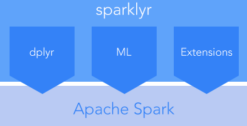
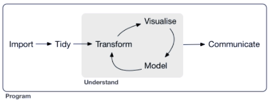

```{r setup, include=FALSE}
knitr::opts_chunk$set(echo = TRUE)
```

This notebook describes how R users can access Spark and make use of Spark resources through the [`sparklyr`](https://CRAN.R-project.org/package=sparklyr) package. 



<br/>
With `sparklyr` R users can:    
* Filter and aggregate Spark datasets and them bring them into R for analysis and visualization    
* Use Spark's distributed machine learning library [MLlib](http://spark.apache.org/docs/latest/mllib-guide.html)  
* Create [extensions](https://spark.rstudio.com/extensions.html) that call the full Spark API and provide interfaces to Spark packages

Another way to think of things is that `sparklyr` alows Spark to act as a backend for `deplyr` and other R packages and become part of the data science workflow in R.



### Preliminaries
In this section we install the `sparklyr` package and then use the function `sparklyr::spark_install()` to install a local copy of `Spark`. 

```{r, eval=FALSE}
install.packages("sparklyr")
library(sparklyr)
spark_install(version = "2.1.0")
```

### Connecting to Spark

There are two ways to use `sparklyr` with `Spark`. We call these two **deployment** modes:  
* Local - running `Spark` locally on the desktop   
* Cluster - working directly within or alongside a Spark cluster ([standalone](http://spark.apache.org/docs/latest/spark-standalone.html), [YARN](http://hadoop.apache.org/docs/current/hadoop-yarn/hadoop-yarn-site/YARN.html), [Mesos](http://mesos.apache.org/), etc.)

For this example we will use a local connection which we can affect either using the function `sparklyr::spark_connect()` or using the Connection window in the RStudio IDE. For information on making cluster connections see the [Deployment and Configuration](https://spark.rstudio.com/articles/deployment-overview.html) overview.

```{r}
library(sparklyr)
sc <- spark_connect(master = "local")
```

### Moving Data into Spark
We begin by copying the some data sets into `Spark`. We will use the `nycflights13` data which we have used before, the `Lahman` dataset containing baseball stats, and good old `iris`.

```{r, eval=FALSE}
install.packages(c("nycflights13", "Lahman"))
```

```{r, message=FALSE}
library(dplyr)
iris_tbl <- copy_to(sc, iris)
flights_tbl <- copy_to(sc, nycflights13::flights, "flights")
batting_tbl <- copy_to(sc, Lahman::Batting, "batting")
```

Now we check to see what tables we have in Spark. Notice that the tables also show uo in the RStudio IDE Connection pane.

```{r}
src_tbls(sc)
```

### Using `dplyr` with data in `Spark`

In this first example, we use `dplyr::filter()` to fetch flights with two minute departure delays.

```{r}
# filter by departure delay and print the first few records
flights_tbl %>% filter(dep_delay == 2)
```

Here we plot data of flight delays.

```{r}
delay <- flights_tbl %>% 
  group_by(tailnum) %>%
  summarise(count = n(), dist = mean(distance), delay = mean(arr_delay)) %>%
  filter(count > 20, dist < 2000, !is.na(delay)) %>%
  collect

# plot delays
library(ggplot2)
ggplot(delay, aes(dist, delay)) +
  geom_point(aes(size = count), alpha = 1/2) +
  geom_smooth() +
  scale_size_area(max_size = 2)
```

In a slightly more elaborate example we show a typical dplyr workflow using the baseball data.

```{r}
batting_tbl
```

```{r}
batting_tbl %>%
  select(playerID, yearID, teamID, G, AB:H) %>%
  arrange(playerID, yearID, teamID) %>%
  group_by(playerID) %>%
  filter(min_rank(desc(H)) <= 2 & H > 0)
```

### Using SQL
We can also use SQL queries to interrogate tables in a `Spark` cluster. The `spark_connection` object implements a DBI interface for Spark. We can use `dbGetQuery` to execute SQL and return the result as an R data frame. We could have used a SQL query to look at just the first 10 rows of the baseball data set.

```{r}
library(DBI)
batting_preview <- dbGetQuery(sc, "SELECT * FROM batting LIMIT 10")
batting_preview
```


### More Information

* [Online Documentation](https://spark.rstudio.com/index.html)   
* [Gallery of Examples](https://spark.rstudio.com/articles/gallery.html)   
* [Using sparklyr with and Apache SparkCluster](https://spark.rstudio.com/examples-emr.html)


